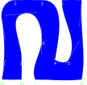
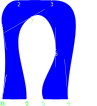

https://en.wikipedia.org/wiki/C._N._Karunakaran

This is a very irregular shape. So we don't use any pens. We draw the outline stroke directly.

Also illustrates debugging concepts-drawing bezier controls and point labels.

