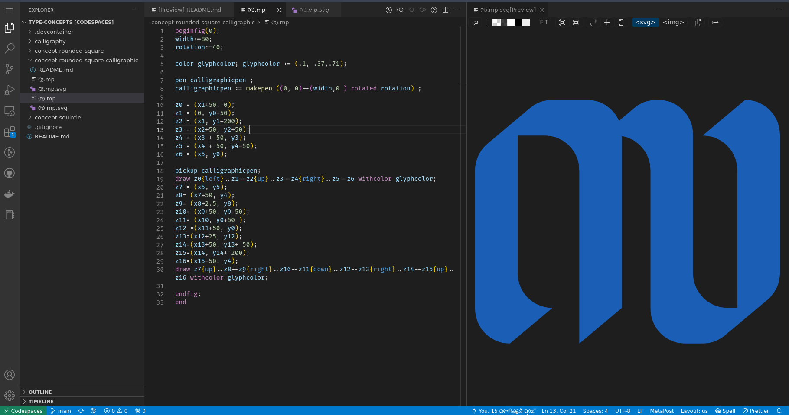

# Typeface design concepts illustrated using metapost

Recently [I started using metapost for my typeface design projects](https://thottingal.in/blog/2022/10/05/nupuram/). Now I cannot think of designing a typeface without metapost. It took many months to setup a proper workflow based on metapost to create a modern typeface, often variable typeface.

Installing, and using metapost to quickly try out design of glyph shape is often difficult. This is a prebuilt github codespace where you can just open the codebase in VS code in local or in browser. You can immediately start editing and live previewing SVGs generated from your metapost.

SVGs will be automatically created as soon as you save the metapost file. Opening the svg, you will see a live preview in right side panel. It get automatically updated whenever you save metapost source file.

Please refer sample .mp files in the repo to get started.

## Creating a font

Creating a font from these svgs require more sophisticated tooling and refactoring. You may refer the following typeface codebases. These typefaces use additional helper functions to automate repeated tasks and have configurations that define how glyphs are created in consisistent manner. And fonts are not just glyphs.

* https://gitlab.com/smc/fonts/Nupuram
* https://gitlab.com/smc/fonts/Malini
